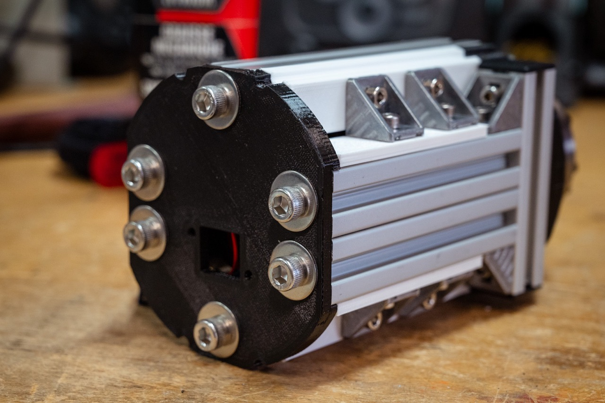

# DHEM: another DIY Harmonic Equatorial Mount
## What the hell is this DHEM thing?

DHEM (DIY Harmonic Equatorial Mount) is an equatorial mount for observation or astrophotography. It is based on the use of a harmonic reducer. The mount is designed to be inexpensive in relation to its performance, transportable, with a relatively large load capacity. Most importantly, this mount is easy to build: no need for machine tools or other laser-cutting-water-jet-plasma-turbo-piston-5-axis machines. A shopping list, a screwdriver, a saw and some resourcefulness: you've got everything you need to make a DHEM. The ultimate aim is to distribute its design as an open-source product for personal use.


The technology used in this mount is similar to that used in robotics or industrial production lines. The main mechanical gearbox is a harmonic gearbox ([wikipedia](https://en.wikipedia.org/wiki/Strain_wave_gearing)). 


It can produce surprising results for an astronomical mount at first glance; the mount appears grossly undersized and unbalanced, whereas the whole assembly is extremely robust and stable, with enormous torque.
Conventional equatorial mounts require the use of counterweights. The aim of this development is to make available the design of a harmonic mount that can be built in your garage, with few tools or mechanical knowledge, for a price of less than 1000€. Of course, the proud aim is to achieve performance equivalent to that of commercial harmonic reduction mounts.

- Harmonic gear motor
- BOM less than 1000€
- No need for machine tools: all you need is a saw and a screwdriver!
- Lightweight: max 5 kg
- Minimum load weight without counterweight: > 12kg (to be tested)

The first results of the performance tests are up to my expectations for the moment. I hope this github repository can help you design or reproduce this equatorial mount. Please be patient, I'm only working on this project in my spare time. I'll update the testing progress on this readme. ✍️

## Support

Hey! Help me out for a couple of :beers: !

<a href="https://www.buymeacoffee.com/polvinc" target="_blank"></a>


# Design
## 3D design
The 3D design was carried out on SolidWorks 2022 and OnShape. Here's a [sharing of the design on OnShape](https://cad.onshape.com/documents/8746a60a1be674f3c5c8962f/w/75df6ccf1ddba0eb14d42c4d/e/8f9338159e7a1463ffcd3219?renderMode=0&uiState=651bece70db1c514a39d73c3). The project is a bit of a mess, but it includes all the components needed to assemble the mount. You will find all stl files for printing in this repo.


## Bill of materials
Here's the shopping list for two axes. Prices are approximate: I already had quite a few parts in stock when designing the DHEM. The total investment is around 900€ for the mechanics, and I estimate the cost of making an [OnStep](https://onstep.groups.io/g/main/wiki/Home) MiniPCB2 controller at 100€.

<b>The estimated total cost of the equatorial mount is less than 1000€</b>.

I think you can save a lot of money by going to other supply sites. For example, I got about €70 worth of Bosch M4 T-nuts from RS Components, when I could have got them for 5 or 10 times less with no-name ([for example](https://www.amazon.fr/EYPINS-Connecteur-Aluminium-28x28x20mm-dextrusion/dp/B08GPRB9W4/?th=1), [another example](https://www.amazon.fr/alwaiiz-aluminium-galvanisé-dextrusion-européenne/dp/B0B5GKW3MT/)). I had Bosch in my stuff, so I didn't deprive myself.


| Name | Quantity | Reference | Price € | Link |
| -------- | -------- | -------- | -------- | -------- |
M4x8 | 32 | - | a few | 
M4x10 | 16 | - | a few | 
M4x16 | 20 | - | a few | 
M4x20 | 20 | - | a few | 
M5x10 | 8 | - | a few | 
M5x20 | 6 | - | a few | 
M6x16 | 12 | - | a few | 
20mm Bosch Rexroth profile | 1 | 212-3292 | 25 | [RS components](https://fr.rs-online.com/web/p/tubes-et-profiles-de-structures/2123292?gb=s)
T-nuts | 64 | 466-7281 | 70 | [RS components](https://fr.rs-online.com/web/p/raccords-pour-elements-de-structure/4667281)
M4 Angle Bracket | 24 | 180-9136 | 30 | [RS components](https://fr.rs-online.com/web/p/raccords-pour-elements-de-structure/1809136)
M4 inside M6 insert | 4 | B096VSWCBQ | 8 | [Amazon FR](https://www.amazon.fr/dp/B096VSWCBQ?psc=1&ref=ppx_yo2ov_dt_b_product_details)
Dovetail Clamp | 1 | EUF9144C | 30 | [Amazon FR](https://www.amazon.fr/gp/product/B08TC111QC/ref=ppx_yo_dt_b_search_asin_title?ie=UTF8&psc=1)
Dovetail Mounting Plate | 1 | EUF9175B | 20 | [Amazon FR](https://www.amazon.fr/gp/product/B08XLWP13X/ref=ppx_yo_dt_b_search_asin_title?ie=UTF8&psc=1)
Arca clamp | 1 | B0BW3SSHY1 | 20 | [Amazon FR](https://www.amazon.fr/QLOUNI-dégagement-Déclenchement-Appareil-Universelle/dp/B0BW3SSHY1/)
Arca mounting | 1 | B0771KW7TK | 15 | [Amazon FR](https://www.amazon.fr/gp/product/B0771KW7TK/ref=ppx_yo_dt_b_search_asin_title?ie=UTF8&th=1)
| Nema 17 with 10:1 Planetary Gearbox | 2 | 17HS15-1584S-MG10 | 60 | [StepperOnline](https://www.omc-stepperonline.com/fr/nema-17-moteur-pas-a-pas-l-40mm-rapport-de-vitesse-10-1-reducteur-planetaire-serie-mg-17hs15-1584s-mg10)
Harmonic Drive | 2 | CSF-17-100-2UH | 550 | [ebay](https://www.ebay.fr/sch/i.html?_from=R40&_trksid=p2334524.m570.l1313&_nkw=CSF-17-100-2UH&_sacat=0&LH_TitleDesc=0&_odkw=CSF-17-100-2UH-LW&_osacat=0) ([datasheet](https://www.harmonicdrive.net/products/gear-units/gear-units/csf-2uh/csf-17-100-2uh))
RJ45 connector | 2 | MRJ5380M1 | 35 | [Farnell](https://fr.farnell.com/amphenol-communications-solutions/mrj5380m1/conn-rj45-90-jack-8p8c-1-port/dp/4122450)
OnStep controller | 1 | MiniPCB2 | ~100 | [oshwlab](https://oshwlab.com/hujer.roman/minipcb2)


# Assembly


## Harmonic drive
Harmonic gearboxes ([wikipedia](https://en.wikipedia.org/wiki/Strain_wave_gearing)), or more precisely strain wave gears, are a type of gear mechanism that transmits much more torque than other common gears. This is mainly due to the fact that there are many more teeth engaged at once. One of the major advantages of these gears is that they have virtually no backlash, partly because they use deformation. It's a bit like belts, which are supposed to be more or less backlash-free, but harmonic gearboxes use deformable metal spring steels, which are much better than belts.

Put another way, in the case of an astronomical mount: they can drive much heavier loads without the need for counterweights, all with a very low self-weight!

<p align="center">
  
  
</p> 

The harmonic reducer model chosen [CSF-17-100-2UH](https://harmonicdrive.de/fileadmin/user_upload/Harmonic_Drive_Gears_EN_1050860_06_2022.pdf#page=50) is the same as [Alan](https://alanz.info/posts/2022/07/diy-mount/) DIY mount. You can find lots of them on ebay. This one has a reduction ratio of 1/100. It has the good fortune to meet my requirements, and to have been tested for another equatorial mount. Why deprive yourself? According to datasheet, it can handle more than 50Nm of torque and it also has a very comfortable permissible radial load of over 70Kg.
<p align="center">
  
</p>

Using [OnStep's configurator spreadsheet](http://o.baheyeldin.com:1111), I chose to drive the harmonic gearbox with a planetary gearbox [17HS15-1584S-MG10](https://www.omc-stepperonline.com/fr/nema-17-moteur-pas-a-pas-l-40mm-rapport-de-vitesse-10-1-reducteur-planetaire-serie-mg-17hs15-1584s-mg10), in order to achieve good tracking resolution, a good slew rate and a good number of steps/deg. Its reduction ratio is 1/10 and it is given for a low backlash (around 30 arcmin). Seen through the telescope, this low backlash will be divided by 100 by the main gearbox. You can probably use another motor with a planetary gearbox.

<p align="center">
  
  
</p>

## Motor holding


We start assembling the mount, attaching the motor and its planet gear to the 3D-printed motor spacer with M4 screws. I printed most of my parts in PETG or ABS, with an Ultimaker S7, in 0.15mm layers, slow speed, high infill, and 101% flow.
Two 20mm Bosch Rexroth profile bars are cut at 120mm, and tapped on both sides with M6. An M6 (external) to M4 (internal) insert is housed on one side of the two Rexroths. These two bars are then positioned in their housings, and secured with 4 T-nuts. The M6/M4 insert is located on the motor shaft side. It will be used to attach the assembly to the harmonic gearbox. Note the orientation of the Nema 17 motor in relation to the two 120mm bars. The motor wires must be oriented in the space available on the bar side.


Once the CSF spacer has been centered on the harmonic gearbox, the assembly is secured to the gearbox using two M4 screws. Make sure you fit your 2 M4 screws into two plain holes in the gearbox flange. Do not use the tapped holes (every other hole is plain).
Don't forget to insert the key on the motor shaft, and secure the shaft in the harmonic gearbox with the two M3 set screws. Make sure that the bars are properly aligned, perpendicular to the bearing plane on the harmonic gearbox.

As can be seen from the images, the 3D printed motor spacer has no major structural function. It provides a few degrees of flexibility between the planetary gearbox shaft and the harmonic gearbox bore. Its only structural function is to hold and space the motor, with only a degree of rigidity on the torque transmission. So it's no big deal that this part is 3D printed and not made of metal. Once again, however, take care to print the parts properly.

<p align="center">
  
  
  
</p>

## Sides Rex


To assemble the frame sides, first cut two 76mm bars and four 100mm bars. You could also use 2 Bosch Rexroth [20 x 40 mm aluminium profiles](https://fr.rs-online.com/web/p/tubes-et-profiles-de-structures/2123294?gb=s), cut to 100mm. The 100mm bars are M6 tapped on one side. These threads will be used to secure the frame's back plate. Prepare 4 angle brackets with M4 and T-nuts.

<p align="center">
  
  
</p> 

Assemble with M4 T-nuts and four squares as shown in the pictures. Take care to ensure that the T-nuts are correctly seated in the grooves of the Rexroth bars.

<p align="center">
  
  
</p>

The next step is to assemble the sides on the harmonic reducer. The harmonic reducer is always the reference point for perpendicularity. Fixing is achieved with 4 M4 screws and 4 T-nuts.

<p align="center">
  
  
  
</p> 


Now it's time to position the frame blanks, using the two printed supports to bridge the gap between the brackets and the bars. Take care to align the brackets with the Rexroths already in place, mainly for aesthetic reasons, but also for the future attachment of the dovetail/arca mounting plates. There are a couple of parts to be printed four times, and oriented correctly along the aluminium profile sides. The most important thing in this part of the assembly is to properly secure the T-nuts in the profile. The screws compress the 3D-printed spacers, so there's no risk of weakening the structure.


Finally, secure the bottom plate with 6 M6 screws and washers. When you've done this, you can check that your Rexroths are correctly aligned. Beforehand, you can attach the ethernet connector to the back plate with M3, after soldering the motor cable to it. I chose the MRJ5380M1 because my OnStep comes out in RJ45 and I had some in stock, but it is not necessarily the cheapest of the RJ45 connectors. You may need to modify this part if you choose a different RJ45 or other connector.

You have almost finished assembling a DHEM axis!

<p align="center">
  
  
</p>

## Vixen/Arca mount
All that remains is to attach the adapter rings for your dovetail/arca clamp. I also made a plate from a block of aluminum, which seemed more rigid to me during the carrying mass tests. It's up to you to design your vixen clamp adapter if you don't choose the BOM one. I've made two versions: an arca swiss one for photo lenses, and a vixen one for telescopes.
<p align="center">
  
  
  
</p>

## Final assembly
<p align="center">
  
  
</p>

I had in stock a small equatorial table (Omegon 55mm) on which I put the mount. In the future, I plan to design a Rexroth-based equatorial table wich fits with the DHEM.
<p align="center">
  
  
  
</p> 


# Tests


- ✍️ Work still in progress
- [Vélizy astronomy club](https://www.astro-velizy.fr/)
- First tests
- Strategy
- Astrophoto
- Mount capacity
- Mechanics
- Electronics
- Software

## Periodic error measurements
One way to measure the mount's periodic error is to derange its polar alignment by 5-10°, point at a star in the celestial equator zone, set the mount to tracking (it thinks it's compensating for the earth's rotation when it's misaligned), and let a star drift in the field for a while. By stacking the images of this star's drift, we can observe an image of the periodic error pattern. If the star drift is perfectly linear, the mount has no periodic error. If, on the other hand, the star drift follows a sinusoidal pattern, then we observe a periodic error due to the mechanics of the mount. Pixel measurements are then used to quantify the error.

Radians are converted to arcsec as: <b>1 rad = 3600 x 180 / pi = 206264.81 arcsec</b>. 
Resolution in arcsec per pixel can then be calculated as follows: 
<p align="center">
  <b>pixel[µm] x 206264.81[arcsec] / (1000 x focal)[µm] = [arcsec/pixel]</b>
</p>

In this test, I used a 480mm focal length and a CCD with 4.93µm pixel size (thanks to [Vélizy astronomy club](https://www.astro-velizy.fr/)). This gives an image resolution of around 2.12"/px. Below is a stacked image of approximately 30min of exposure (180 exposures of 10sec). The telescope was pointing at Altair. We could take into account the correction linked to the choice of star: Altair is at 8°57' apparent declination. We therefore need to multiply the amplitude by 1.012 (or forget this correction, as we're talking about a 1% error).
<p align="center">
  
</p>

Then, I take a few pixel measurements with Python help (source: [guiqwt](https://github.com/PlotPyStack/guiqwt)).

```python
import os.path as osp
from guiqwt.plot import ImageDialog
from guiqwt.tools import AnnotatedSegmentTool, AnnotatedPointTool, XCursorTool
from guiqwt.builder import make

def window():
    win = ImageDialog(toolbar=True, wintitle="PEC")
    for toolklass in (XCursorTool, AnnotatedSegmentTool, AnnotatedPointTool):
        win.add_tool(toolklass)
    return win

def app():
    import guidata
    _app = guidata.qapplication()
    fn = osp.join(osp.dirname(__file__), 'periodic-error-all_stacked.jpeg')
    win = window()
    image = make.image(filename=fn, colormap="bone")
    plot = win.get_plot()
    plot.add_item(image)
    win.exec_()

if __name__ == "__main__":
    app()
```

<p align="center">
  
  
  
</p> <p align="center">
  
  
  
</p>

I measure about 22px peak-to-peak amplitude, i.e. <b>about ±23" periodic error</b>. 

The periodic error of harmonic gears is naturally greater than that of worm gears. This is mainly due to the fact that the pitch circle of the gear is relatively small. The datasheet also provides a precision <1.5 arcmin, i.e. 90arcsec.
Self-guidance is therefore necessary for photography, and unguided photography is possible using short focal length lenses and/or short exposure. The ripple is smooth, with no hard points. The period is long compared with the few seconds of integration required with a guiding camera.

If I dare to compare with commercially available harmonic mount, I can see that we're in the right order of magnitude. For example, for the ZWO AM5, many different values can be found on the Internet, but the order of magnitude of the periodic error seems to be around ±20" ([ZWO](https://astronomy-imaging-camera.com/tutorials/10-things-you-need-to-know-about-the-custom-am5s-pe-test-report-provided-by-zwo/)). For the Rainbow Astro RST-135, it's about ±30" ([Rainbow Astro](https://www.rainbowastro.com/faq-eng/#:~:text=We%20don%27t%20make%20an,length%20lenses%20and%20short%20exposure)).

The sequence of 180 images was produced between 23h34m17s and 00h11m10s, i.e. 36.9min. The stacked image shows about 5 periods of oscillation. From this, we can deduce the duration of an oscillation period to be approximately 7.4min. The measured period is therefore <b>approximately 440 seconds</b>. In fact, if we look at the operation of a harmonic gearbox, the wave generator (attached to input shaft) produces a rotation of 100 turns per 360 degrees on the output shaft. For each revolution of the wave generator, we have twice the period of the potential periodic error. We can deduce the theoretical period of the periodic error equal to (24x60x60)/(2x100)=432sec. We're pretty close to what we roughly measure on the stacked image, which is reassuring! We can assume that the period is somewhere around these two values. Only the training of a self-guidance model will be able to tell.

## Next step: analysis of dynamic guiding behavior
- How does Onstep+DHEM behave when correction pulses are sent by INDI commands?
- How does the mechanics behave in terms of inertia, torque and increase in on-board mass (with or without counterweight)?? 
- What is the impact of the small mechanical play on the declination axis during correction pulses (tilting moment stiffness = 18.6 Nm/arcmin)?
- Take a picture !
- Comparison with AM5 and EQ6-R
- And so on !


# About me
I'm a novice in astronomy or astrophotography, but I've been coding and making stuff, among other things for photography, for over 15 years now. I am a scientist, an expert in infrasound sensors, which has nothing to do with astrophotography, but above all I am eager for new challenges. Even though I don't have a telescope (for the moment, only a few pro DSLR cameras and telephoto lenses), about 2 years ago, in my free time, I set out this design.

To help me in my task, I have drawn on the work of several sources. I can't mention them all, but I'd like to thank the work of [Roman Hujer](https://github.com/romanhujer/HrEM) and [Kenichi Aihara](https://mr-deep-addicted.com/?page_id=1770), who introduced me to the benefits of a harmonic reducer for an equatorial mount using 3D printing. For the design I wanted to create, I had to limit machining and parts with adjustment. To achieve this, I designed the robot with a direct axial drive. As my work progressed, I discovered [Alan Zhao](https://alanz.info/posts/2022/07/diy-mount/)'s impressive work, and drew inspiration from it.

I must also mention the [Onstep](http://onstep.groups.io/) project, an extraordinary DIY electronics project that makes the design of a goto astronomical mount accessible. 

I've already designed or built several robots for automated photo-taking. These were either made from designs sourced from various online designers, or were self-designed. I'm only sharing the current version, the DHEM equatorial mount, which is clearly the most accomplished.
<p align="center">
  
  
  
  
</p> 

The first results of the performance tests are up to my expectations for the moment. I hope this github repository can help you design or reproduce this equatorial mount. Please be patient, I'm only working on this project in my spare time. I'll update the testing progress on this readme. ✍️


# Thanks
Many thanks to the [Vélizy astronomy club](https://www.astro-velizy.fr/) (Paris region in France), and its very helpful members, for the advice, the loan of equipment, the time spent testing, and the encouragement in this mount project.